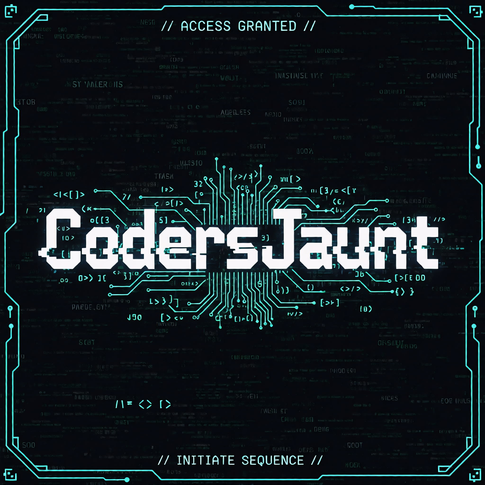

# 🎮 CodersJaunt Python Quiz Games – Designed by @mit

A **learning-first, story-driven Python quiz game series** for students to master Python step by step.


<p align="center">
  
</p>

---

## 📌 Projects Inside

### 🟢 1. Basic Python Quiz Game
📂 `01_Basic_Quiz_Game`

**Focus:** Core Python logic for beginners.  
**Covers:**
- Variables & Input
- Conditions (`if/else`, logical operators)
- Data Structures (`list`, `dict`, `tuple`, `set`)
- Functions & Reusability
- Loops & Game Flow

**Launch Game:** [`GAME-QUIZ.py`](01_Basic_Quiz_Game/GAME-QUIZ.py)

---

### 🔵 2. Advanced Python Quiz Game
📂 `02_Advanced_Quiz_Game`

**Focus:** Professional, defensive, and modular Python.  
**Covers:**
- Object-Oriented Programming (OOP)
- File Handling
- Exception Handling
- Regular Expressions
- Modular Design (`import`, separated files)
- Defensive Programming (safe input & crash-proof logic)

**Launch Game:** [`main.py`](02_Advanced_Quiz_Game/main.py)

---

## 🗂️ Repository Structure

```text
codersJauntGame/
├── 01_Basic_Quiz_Game/
│   ├── GAME-QUIZ.py
│   └── README.md
├── 02_Advanced_Quiz_Game/
│   ├── main.py
│   ├── questions.py
│   ├── toon.py
│   └── README.md
├── img/
│   └── img.jpg
└── README.md

---

▶️ How to Play
# Clone this repository
git clone https://github.com/SwagCode4U/codersJauntGame.git

# Enter the directory
cd codersJauntGame

# Launch Basic Quiz Game
python 01_Basic_Quiz_Game/GAME-QUIZ.py

# Launch Advanced Quiz Game
python 02_Advanced_Quiz_Game/main.py


💡 Tip: Press 9 anytime in either game to exit safely.

## 🎯 Philosophy

> Logic first  
> Syntax second  
> Why always before what  
> Code is art 🧠🐍

**Developed with ❤️ by @mit | CodersJaunt**


